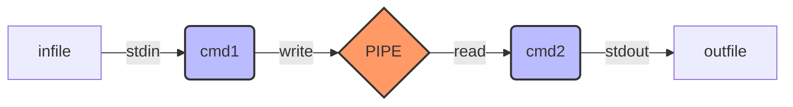

# Pipex

Simulação do mecanismo de pipe (`|`) do Unix em C. O projeto replica o comportamento exato do shell ao conectar a saída de um comando à entrada de outro via redirecionamento de file descriptors.



## 📋 Descrição

O programa executa a seguinte lógica do Bash:

```bash
< input_file cmd1 | cmd2 > output_file

```

Isso significa que o `pipex`:

1. Abre o arquivo de entrada.
2. Executa o **Comando 1** usando o arquivo como entrada.
3. Envia a saída do Comando 1 através de um **Pipe**.
4. Executa o **Comando 2** usando o Pipe como entrada.
5. Escreve o resultado final no arquivo de saída.

## ⚙️ Arquitetura Técnica

O projeto utiliza chamadas de sistema (syscalls) para manipular processos e memória:

* **`pipe()`**: Cria o canal de comunicação unidirecional.
* **`fork()`**: Cria processos filhos para execução paralela.
* **`dup2()`**: Redireciona STDIN e STDOUT para os arquivos ou para o pipe.
* **`execve()`**: Substitui o processo atual pelo binário do comando solicitado.

## 🚀 Como Usar

### Compilação

```bash
make

```

### Execução

A sintaxe é estrita e exige exatamente 4 argumentos:

```bash
./pipex file1 cmd1 cmd2 file2

```

### Exemplos Reais

**1. Contar linhas de um arquivo:**

```bash
./pipex infile "ls -l" "wc -l" outfile

```

*(Equivalente a: `< infile ls -l | wc -l > outfile`)*

**2. Filtrar texto:**

```bash
./pipex infile "grep a" "wc -w" outfile

```

*(Equivalente a: `< infile grep a | wc -w > outfile`)*

## 🛡️ Tratamento de Erros

| Cenário | Comportamento |
| --- | --- |
| **Arquivo de entrada inexistente** | Exibe erro e encerra o processo do cmd1 (comportamento bash). |
| **Comando não encontrado** | Exibe "command not found" e libera memória. |
| **Sem permissão** | Exibe "Permission denied" via `perror`. |
| **Argumentos insuficientes** | Exibe mensagem de uso correto. |

## 📂 Estrutura de Arquivos

* **`pipex.c`**: Lógica principal, criação de pipe, forks e redirecionamento de file descriptors.
* **`pipex_utils.c`**: Funções auxiliares (busca de comando no PATH, abertura de arquivos, limpeza de memória).
* **`pipex.h`**: Headers, structs e declarações de funções.

```


```

